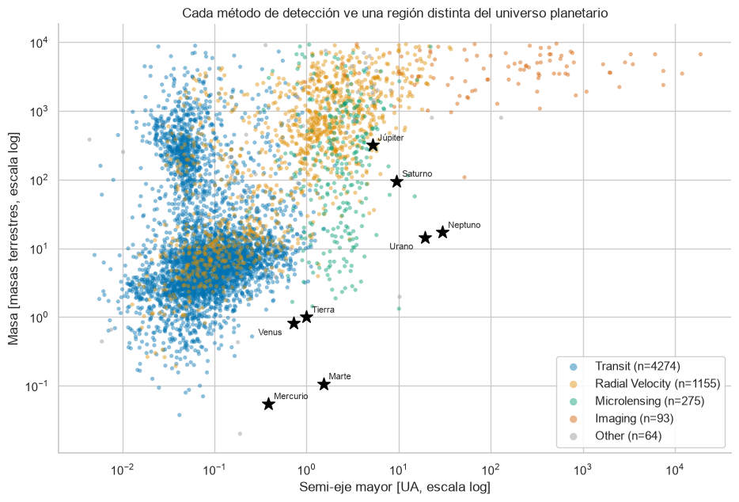
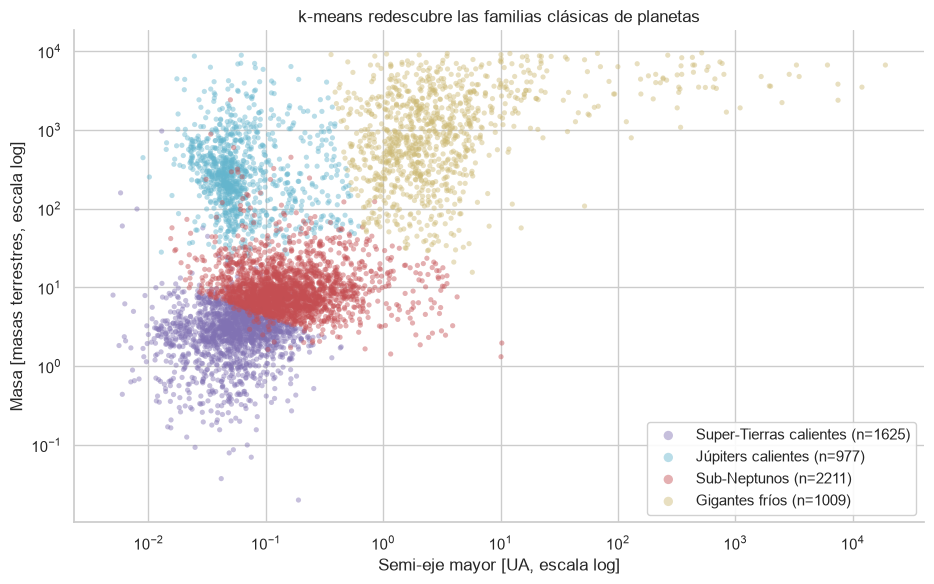

# exoplanet-eda

**Lo que sabemos de los exoplanetas está moldeado por cómo los buscamos.**

Análisis exploratorio (EDA) de los ~6.300 exoplanetas confirmados del
[NASA Exoplanet Archive](https://exoplanetarchive.ipac.caltech.edu/). La tesis
central: el método de detección (tránsito, velocidad radial, microlente,
imagen directa) condiciona *qué* planetas encontramos — y por lo tanto
distorsiona lo que creemos saber sobre la población real de exoplanetas.



Cada método ocupa un territorio casi disjunto del plano masa–distancia. Las
estrellas negras son los planetas del Sistema Solar: la Tierra cae en una
zona que ningún método cubre bien — nuestro propio sistema sería casi
indetectable desde afuera.

## Hallazgos principales

1. **El 93% del catálogo proviene de solo dos métodos** (tránsito 73,8% +
   velocidad radial 18,9%): "el exoplaneta típico" es en rigor el que esos
   dos métodos pueden ver.
2. **Cada método ve un universo distinto**: la mediana de masa cambia ~600×
   entre métodos, y la de distancia orbital ~2.000×.
3. **Hasta la "completitud" del dataset es un sesgo**: el 47% de las masas
   son estimaciones (relación masa-radio), no mediciones, y el patrón de
   datos faltantes es la huella digital de cada técnica (MNAR).
4. **Solo 36 de 6.316 mundos (0,6%) son rocosos y templados** — y casi todos
   orbitan enanas rojas, porque la zona templada de una estrella como el Sol
   está fuera del alcance de los métodos actuales.
5. **k-means redescubre las familias clásicas de planetas** (super-Tierras,
   sub-Neptunos, Júpiters calientes, gigantes fríos) sin saber astronomía —
   y cada familia fue descubierta por métodos distintos.



El desarrollo completo — cada pregunta con su gráfico y su conclusión, y cada
decisión de limpieza justificada — está en
[`notebooks/exoplanet-eda.ipynb`](notebooks/exoplanet-eda.ipynb).

## Datos

- **Fuente:** tabla `PSCompPars` (Planetary Systems Composite Parameters) del
  NASA Exoplanet Archive — una fila por planeta confirmado.
- **Acceso:** consulta ADQL al servicio TAP del archivo, con selección
  explícita de columnas (nada de `select *`). La descarga es un script
  reproducible, no un CSV bajado a mano.
- Los datos crudos **no se versionan**: `data/raw/` se regenera con el script
  y `data/processed/` se regenera corriendo el notebook.

## Cómo reproducir

```powershell
# 1. Clonar y crear el entorno (Windows / PowerShell)
git clone https://github.com/Nachuwu/exoplanet-eda.git
cd exoplanet-eda
python -m venv .venv
.\.venv\Scripts\Activate.ps1
pip install -r requirements.txt

# 2. Descargar los datos crudos
python src/download_data.py

# 3. Abrir y ejecutar el notebook (Run All)
jupyter lab notebooks/exoplanet-eda.ipynb
```

En Linux/macOS la activación del entorno es `source .venv/bin/activate`; el
resto es idéntico.

> Nota: el catálogo está vivo — la NASA agrega planetas cada semana, así que
> los conteos exactos pueden diferir levemente de los del notebook.

## Estructura del repo

```
data/raw/         # CSV crudo descargado vía TAP — nunca se edita, no se versiona
data/processed/   # datos derivados — regenerables desde el notebook
notebooks/        # el análisis completo, se lee de arriba a abajo
src/              # script de ingesta (download_data.py)
assets/           # gráficos exportados para este README
```

## Métodos

- **Perfilado y limpieza documentada**: cada decisión (no eliminar filas, no
  imputar, columnas derivadas) justificada en markdown. El patrón de datos
  faltantes resultó ser un hallazgo, no un trámite.
- **EDA univariado y bivariado** con matplotlib/seaborn: escalas
  logarítmicas, paleta apta para daltonismo y el Sistema Solar como
  referencia en cada gráfico.
- **Filtro de habitabilidad**: regla transparente (radio 0,5–1,6 R⊕ +
  temperatura de equilibrio 180–310 K) más un ranking tipo *Earth Similarity
  Index*. El top-10 recupera los candidatos famosos de la literatura
  (TRAPPIST-1 e, Proxima Cen b, TOI-700 d) sin haberlos buscado.
- **Clustering k-means** sobre masa, radio y semi-eje mayor (log +
  estandarización — el notebook incluye la demostración de por qué ambos
  pasos son obligatorios), con elección de k por codo, silueta e
  interpretabilidad.

## Limitaciones

Este análisis **describe el catálogo, no el universo**: muestra el sesgo de
detección pero no lo corrige (eso requeriría tasas de ocurrencia ajustadas
por probabilidad de detección). La sección 7 del notebook detalla esta y las
demás limitaciones.

## Stack

Python · pandas · numpy · matplotlib · seaborn · scikit-learn · requests · Jupyter
